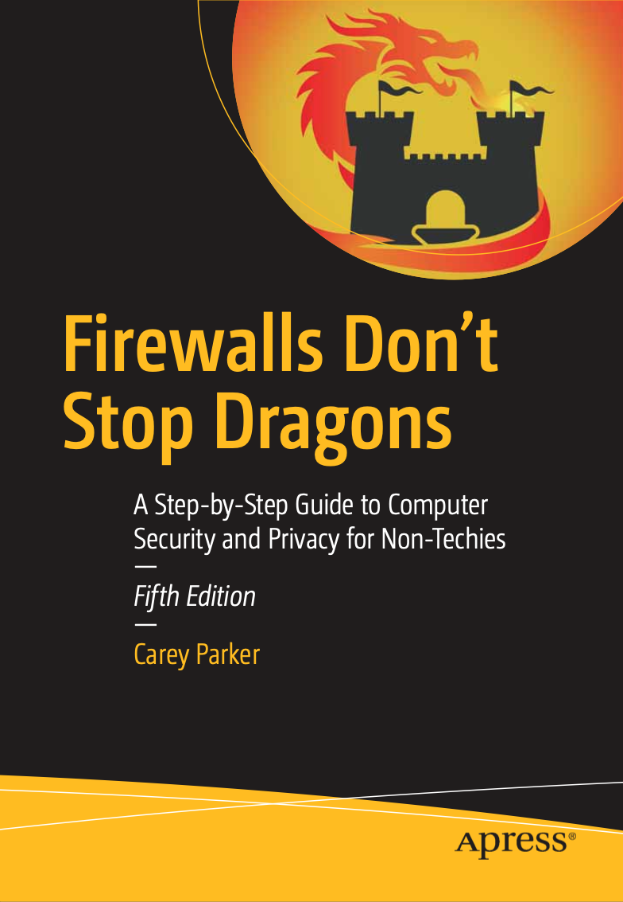

# Book Notes

This repository accompanies [*Firewalls Don't Stop Dragons (5th edition)*](https://firewallsdontstopdragons.com/buy-the-book/) by Carey Parker (Apress, 2023).

See below for information related to previous editions.

## Links, Updates & Other Resources

I have a dedicated web page for the book with several helpful links and resources. You should check this site for important updates and errata before implementing any of the Tips. You might want to bookmark the website and check back periodically.

https://firewallsdontstopdragons.com/book-updates/

Resources on this site:

* **Links:** If you have the paperback version of the book, you can use this web page list to click on the web links. The links are in order by chapter. Futhermore, I will try to keep these links up to date (links inevitably change). 
* **Updates & Errata:** If I find any errors in the book or if any recommendations become stale, I'll add notes here. If you find an error or information that needs updating, *please* contact me at **feedback @ wawaseemedia.com**.

## Website and Other Resources

On my website, you can find :

* [My blog](https://firewallsdontstopdragons.com/)
* [My newsletter](https://firewallsdontstopdragons.com/newsletter/new-newsletter/)
* [My podcast](https://firewallsdontstopdragons.com/podcast/)
* [Contact info](https://firewallsdontstopdragons.com/contact/)
* [Security & Privacy Resources](https://firewallsdontstopdragons.com/resources/)

## Follow Me on Social Media

* [Facebook](https://www.facebook.com/FirewallsDontStopDragons)
* [YouTube](https://www.youtube.com/c/FirewallsDontStopDragons)
* [Twitter](https://twitter.com/firewalldragons)
* [LinkedIn](https://www.linkedin.com/in/firewall-dragons)
* [Mastodon](https://mastodon.social/@FirewallDragons)

## Previous Editions

There are several previous editions of this book:

* [4th edition (2020)](https://link.springer.com/book/10.1007/978-1-4842-6189-7)
* [3rd edition (2018)](https://link.springer.com/book/10.1007/978-1-4842-3852-3)

## Releases

Release v1.0 corresponds to the code in the published book, without corrections or updates.

## Contributions

See the file [Contributing.md](Contributing.md) for more information on how you can contribute to this repository.
