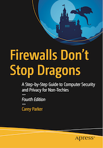

# Apress Source Code

This repository accompanies [*Firewalls Don't Stop Dragons, 4th ed.*](https://www.apress.com/us/book/9781484261880) by Carey Parker (Apress, 2020) as well as the previous edition (https://www.apress.com/us/book/9781484238523)

[comment]: #cover

Download the files as a zip using the green button, or clone the repository to your machine using Git.

## Errata

As I find errors or stale information in the book, I will update the [errata document](errata.md). See this reference for updates. If you find an error or information that needs updating, please contact me at **feedback @ wawaseemedia.com**.

## Web Links from Book

If you have the paperback version of the book, you can use this web page list to click on the web links. The links are in order by chapter. Futhermore, I will try to keep these links up to date (links inevitably change). If you find any errors, **please** let me know: **feedback @ wawaseemedia.com**. 

#### [List of Web Links](https://firewallsdontstopdragons.com/book-links-v4/)

## Website and Other Resources

On my website, you can find [my blog](https://firewallsdontstopdragons.com/), [my newsletter](https://firewallsdontstopdragons.com/newsletter/new-newsletter/), [my podcast](https://firewallsdontstopdragons.com/podcast/), and a web page with several other [great resources](https://firewallsdontstopdragons.com/resources/) for privacy and security.

## Releases

Release v1.0 corresponds to the code in the published book, without corrections or updates.

## Contributions

See the file [Contributing.md](Contributing.md) for more information on how you can contribute to this repository.
